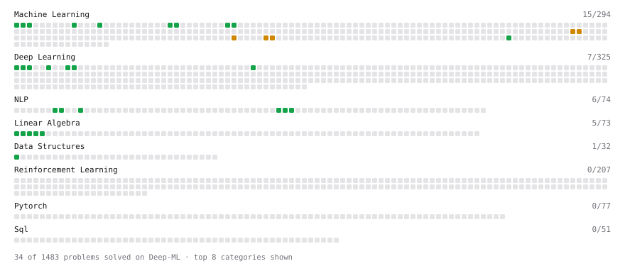

# Deep-ML

My machine learning practice from [Deep-ML](https://www.deep-ml.com). Every solution here was written by hand.

**44** solved · 35 problems · 2 labs · 7 math

[**Browse the interactive portfolio**](https://PTSown0222.github.io/deep-ml/) to replay this filling in over time.

## Problems

| | Difficulty | Solved | |
| --- | --- | --- | --- |
| [Batch Iterator for Dataset](https://www.deep-ml.com/problems/30) | easy | 2026-09-19 | [solution](problems/0030-batch-iterator-for-dataset) |
| [Binary Classification with Logistic Regression](https://www.deep-ml.com/problems/104) | easy | 2026-09-30 | [solution](problems/0104-binary-classification-with-logistic-regression) |
| [Build Vocabulary from Token List](https://www.deep-ml.com/problems/941) | easy | 2026-09-20 | [solution](problems/0941-build-vocabulary-from-token-list) |
| [Calculate Mean Absolute Error (MAE)](https://www.deep-ml.com/problems/93) | easy | 2026-09-30 | [solution](problems/0093-calculate-mean-absolute-error-mae) |
| [Calculate Mean by Row or Column](https://www.deep-ml.com/problems/4) | easy | 2026-09-19 | [solution](problems/0004-calculate-mean-by-row-or-column) |
| [Calculate Perplexity for Language Models](https://www.deep-ml.com/problems/320) | easy | 2026-09-19 | [solution](problems/0320-calculate-perplexity-for-language-models) |
| [Calculate R-squared for Regression Analysis](https://www.deep-ml.com/problems/69) | easy | 2026-09-29 | [solution](problems/0069-calculate-r-squared-for-regression-analysis) |
| [Calculate Root Mean Square Error (RMSE)](https://www.deep-ml.com/problems/71) | easy | 2026-09-29 | [solution](problems/0071-calculate-root-mean-square-error-rmse) |
| [Calculate Unigram Probability from Corpus](https://www.deep-ml.com/problems/129) | easy | 2026-09-19 | [solution](problems/0129-calculate-unigram-probability-from-corpus) |
| [Compute Multi-class Cross-Entropy Loss](https://www.deep-ml.com/problems/134) | easy | 2026-09-27 | [solution](problems/0134-compute-multi-class-cross-entropy-loss) |
| [Exact Match Score with Normalization](https://www.deep-ml.com/problems/325) | easy | 2026-09-20 | [solution](problems/0325-exact-match-score-with-normalization) |
| [Feature Scaling Implementation](https://www.deep-ml.com/problems/16) | easy | 2026-09-25 | [solution](problems/0016-feature-scaling-implementation) |
| [Implement ReLU Activation Function](https://www.deep-ml.com/problems/42) | easy | 2026-09-27 | [solution](problems/0042-implement-relu-activation-function) |
| [Implementation of Log Softmax Function](https://www.deep-ml.com/problems/39) | easy | 2026-09-27 | [solution](problems/0039-implementation-of-log-softmax-function) |
| [Leaky ReLU Activation Function](https://www.deep-ml.com/problems/44) | easy | 2026-09-27 | [solution](problems/0044-leaky-relu-activation-function) |
| [Linear Regression Using Gradient Descent](https://www.deep-ml.com/problems/15) | easy | 2026-09-25 | [solution](problems/0015-linear-regression-using-gradient-descent) |
| [Linear Regression Using Normal Equation](https://www.deep-ml.com/problems/14) | easy | 2026-09-25 | [solution](problems/0014-linear-regression-using-normal-equation) |
| [Matrix-Vector Dot Product](https://www.deep-ml.com/problems/1) | easy | 2026-09-18 | [solution](problems/0001-matrix-vector-dot-product) |
| [Min-Max Scaling of Feature Values](https://www.deep-ml.com/problems/112) | easy | 2026-09-25 | [solution](problems/0112-min-max-scaling-of-feature-values) |
| [One-Hot Encoding of Nominal Values](https://www.deep-ml.com/problems/34) | easy | 2026-09-25 | [solution](problems/0034-one-hot-encoding-of-nominal-values) |
| [Random Shuffle of Dataset](https://www.deep-ml.com/problems/29) | easy | 2026-10-01 | [solution](problems/0029-random-shuffle-of-dataset) |
| [Random Train/Validation/Test Split with Shuffling](https://www.deep-ml.com/problems/1058) | easy | 2026-09-25 | [solution](problems/1058-random-train-validation-test-split-with-shuffling) |
| [Regex-Based Text Tokenizer](https://www.deep-ml.com/problems/940) | easy | 2026-09-20 | [solution](problems/0940-regex-based-text-tokenizer) |
| [Reshape Matrix](https://www.deep-ml.com/problems/3) | easy | 2026-09-19 | [solution](problems/0003-reshape-matrix) |
| [Scalar Multiplication of a Matrix](https://www.deep-ml.com/problems/5) | easy | 2026-09-19 | [solution](problems/0005-scalar-multiplication-of-a-matrix) |
| [Sigmoid Activation Function Understanding](https://www.deep-ml.com/problems/22) | easy | 2026-09-19 | [solution](problems/0022-sigmoid-activation-function-understanding) |
| [Simple Word Tokenizer Encode and Decode](https://www.deep-ml.com/problems/942) | easy | 2026-09-20 | [solution](problems/0942-simple-word-tokenizer-encode-and-decode) |
| [Single Neuron](https://www.deep-ml.com/problems/24) | easy | 2026-09-19 | [solution](problems/0024-single-neuron) |
| [Softmax Activation Function Implementation ](https://www.deep-ml.com/problems/23) | easy | 2026-09-19 | [solution](problems/0023-softmax-activation-function-implementation) |
| [Transpose of a Matrix](https://www.deep-ml.com/problems/2) | easy | 2026-09-18 | [solution](problems/0002-transpose-of-a-matrix) |
| [Dummy Classifier Baseline](https://www.deep-ml.com/problems/847) | medium | 2026-09-25 | [solution](problems/0847-dummy-classifier-baseline) |
| [Dummy Regressor Baseline](https://www.deep-ml.com/problems/848) | medium | 2026-09-25 | [solution](problems/0848-dummy-regressor-baseline) |
| [Mini-Batch Gradient Descent Step for Linear Regression](https://www.deep-ml.com/problems/803) | medium | 2026-09-27 | [solution](problems/0803-mini-batch-gradient-descent-step-for-linear-regression) |
| [StandardScaler Fit and Transform](https://www.deep-ml.com/problems/842) | medium | 2026-09-25 | [solution](problems/0842-standardscaler-fit-and-transform) |
| [Stochastic Gradient Descent Step for Linear Regression](https://www.deep-ml.com/problems/802) | medium | 2026-09-25 | [solution](problems/0802-stochastic-gradient-descent-step-for-linear-regression) |

## Labs

| | Difficulty | Solved | |
| --- | --- | --- | --- |
| [Train a Binary Classifier](https://www.deep-ml.com/labs/23) | easy | 2026-09-19 | [solution](labs/0023-train-a-binary-classifier) |
| [Train a Linear Regression Model](https://www.deep-ml.com/labs/18) | easy | 2026-09-18 | [solution](labs/0018-train-a-linear-regression-model) |

## Math

| | Difficulty | Solved | |
| --- | --- | --- | --- |
| [Bytes in the KV Cache (MHA, GQA, MQA, MLA)](https://www.deep-ml.com/math-problems/62) | easy | 2026-09-29 | [solution](math/0062-bytes-in-the-kv-cache-mha-gqa-mqa-mla) |
| [Derivatives and Gradients](https://www.deep-ml.com/math-problems/1) | easy | 2026-09-19 | [solution](math/0001-derivatives-and-gradients) |
| [Descriptive Statistics](https://www.deep-ml.com/math-problems/18) | easy | 2026-09-20 | [solution](math/0018-descriptive-statistics) |
| [Expectation and Variance Algebra](https://www.deep-ml.com/math-problems/33) | easy | 2026-09-29 | [solution](math/0033-expectation-and-variance-algebra) |
| [Gradient Descent Updates](https://www.deep-ml.com/math-problems/5) | easy | 2026-09-19 | [solution](math/0005-gradient-descent-updates) |
| [ML Workflow Basics](https://www.deep-ml.com/math-problems/30) | easy | 2026-09-18 | [solution](math/0030-ml-workflow-basics) |
| [Least Squares and the Normal Equations](https://www.deep-ml.com/math-problems/34) | medium | 2026-09-29 | [solution](math/0034-least-squares-and-the-normal-equations) |

---

_This file is regenerated by Deep-ML on every push._
